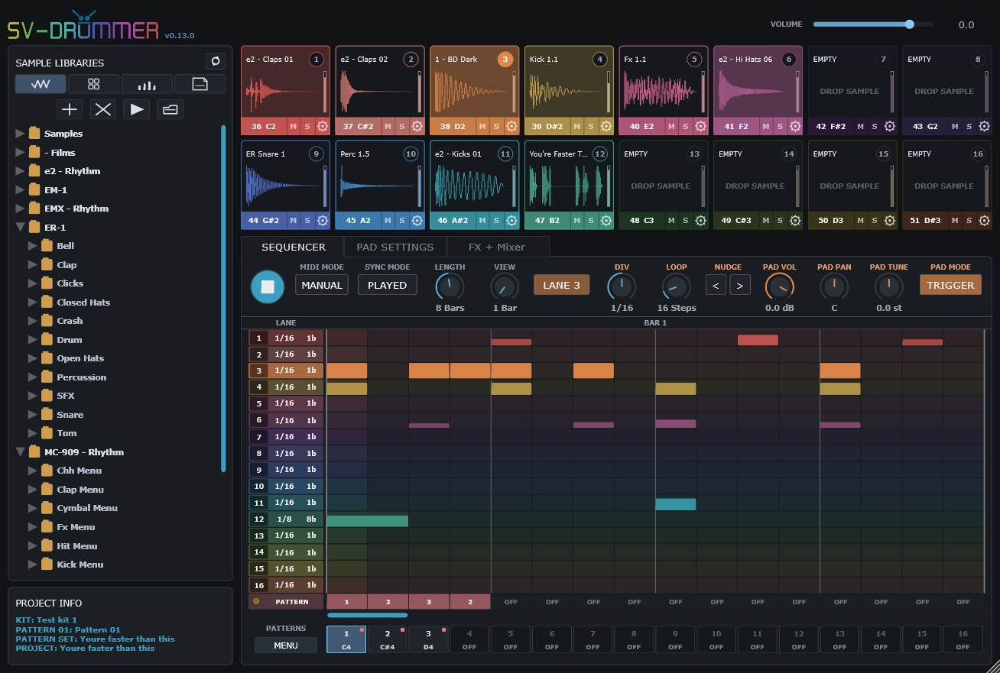
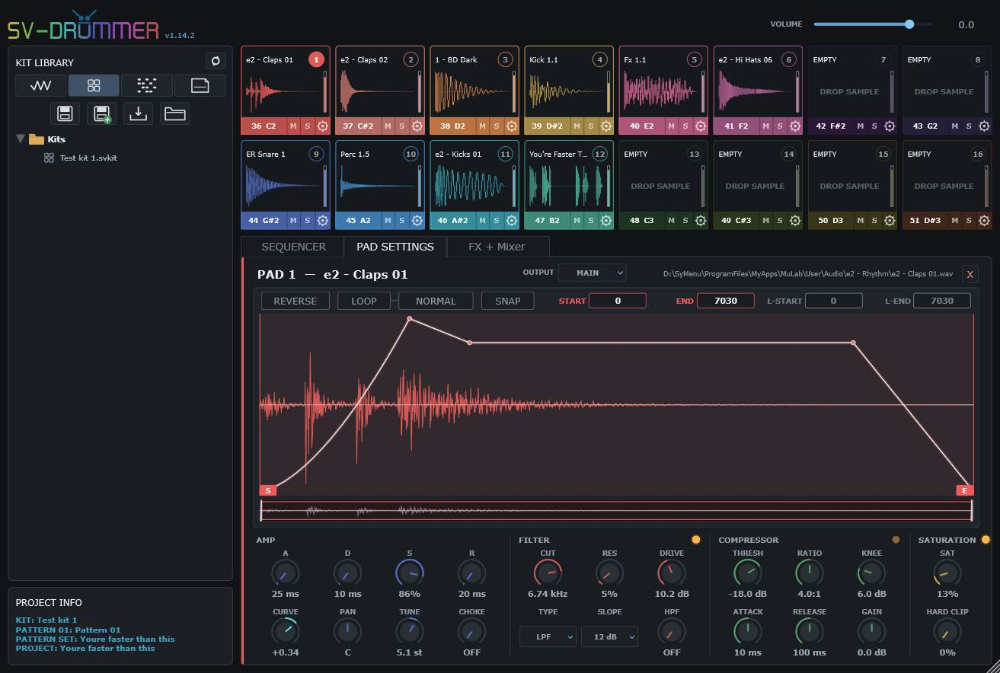
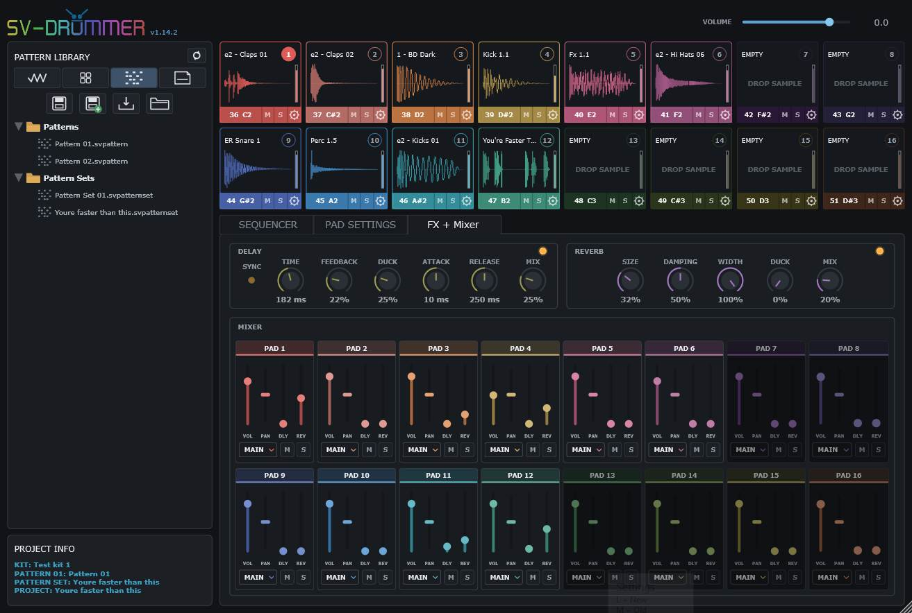

# SV-Drummer

[](https://github.com/sl2365/SV-Drummer/releases/latest/download/SV-Drummer.rar)
[](https://github.com/sl2365/SV-Drummer/releases)

[](https://github.com/sl2365/SV-Drummer/releases/latest)
[](https://github.com/sl2365/SV-Drummer/releases)

[](https://github.com/sl2365/SV-Drummer/activity)
[](https://github.com/sl2365/SV-Drummer/activity)

SV-Drummer is a portable Windows x64 VST3 drum sampler, pattern sequencer and
mixer. It combines sixteen sample pads, detailed per-pad sound shaping, a
sixteen-lane host-synchronised sequencer, Pattern chaining, global Delay and
Reverb, and MAIN plus sixteen optional stereo AUX outputs.

Samples can be organised in the built-in Browser, dragged directly onto pads,
edited non-destructively and saved as reusable Kits. Patterns, complete Pattern
Sets and full Projects can also be saved independently, making it easy to mix
and match sounds and rhythms.





## Main features

- Sixteen colour-coded sample pads with MIDI triggering, Mute, Solo and per-pad
  Volume, Pan, Tune, Choke and output routing.
- WAV, MP3, OGG, FLAC, AIFF and AIF sample support.
- Non-destructive waveform editing with Start, End, Loop Start and Loop End
  markers, zero-crossing Snap, Reverse and Normal/Ping-Pong looping.
- Per-pad ADSR amplitude envelope with adjustable attack curve.
- Per-pad multimode Filter, Compressor, Saturation and Hard Clip processing.
- Sixteen-lane step sequencer with per-lane Division, Loop length, velocity,
  Trigger/Gated playback, Nudge, Copy, Paste, Random, Clear and Undo.
- Sixteen Pattern slots plus a Pattern-chain lane for arranging complete
  Patterns into longer performances.
- Manual, Gate and Hold MIDI Pattern modes with Played, Beat and Bar switching.
- Global Delay and Reverb with independent sends and ducking.
- Sixteen-channel pad mixer with Volume, Pan, Mute, Solo, Output, Delay Send and
  Reverb Send.
- MAIN stereo output and sixteen optional stereo AUX outputs.
- Portable Kits, Patterns, Pattern Sets, Projects and settings.
- Resizable interface from 75% to 200%, remembered between sessions.

## Installation

SV-Drummer is supplied as a portable single-file Windows x64 VST3.

1. Download and extract the latest release.
2. Keep `SV-Drummer.vst3` and its `Data` folder together in the same writable
   directory.
3. Add that directory to your host's VST3 scan paths, if necessary.
4. Rescan plug-ins and load **SV-Drummer** as an instrument.

The plug-in does not use the Windows Registry or system settings folders. Its
libraries and preferences live beside the plug-in:

```text
SV-Drummer.vst3
Data/
  Samples/
  Kits/
  Patterns/
    Patterns/
    Pattern Sets/
  Projects/
  Settings/
    SV-Drummer.ini
```

Some folders are created automatically the first time their feature is used.
Do not separate the `Data` folder from the VST3 if you want portable paths and
settings to continue working.

## Quick start

1. Open the **Samples** Browser tab.
2. Click **+** to add a sample-library folder. Added folders are remembered
   automatically; no manual Browser save is required.
3. Expand a folder and drag an audio file onto a drum pad.
4. Click a pad's numbered selector to make it the active pad.
5. Open **Pad Settings** to adjust its sample range, envelope and effects.
6. Open **Sequencer**, left-click steps to add them and start the host transport.
7. Click SV-Drummer's Play button to enable sequencer playback.
8. Save the result as a Kit, Pattern, Pattern Set or Project as required.

## Browser

The Browser contains four icon tabs:

### Samples

- **+** adds a sample-library folder.
- **X** removes the selected folder from the Browser after confirmation. The
  folder and its files are not deleted from disk.
- **Preview** auditions the selected audio file without loading it onto a pad.
- Right-clicking an audio file previews it immediately.
- **Open Folder** opens the current library location in Windows Explorer.
- Drag an audio file from the Browser or Windows Explorer onto a pad to load it.

Sample trimming, looping and processing are non-destructive. SV-Drummer never
overwrites the source audio file.

### Kits

A Kit stores all sixteen sample assignments and their complete pad settings,
including trim and loop points, envelopes, Filter, Compressor, Saturation,
Volume, Pan, Tune, Choke, mixer sends and output assignments.

- **Save** updates the associated Kit. If it has never been saved, the Save As
  dialogue opens first.
- **Save As** always asks for a new name and location.
- **Load** browses for a `.svkit` file anywhere on disk.
- A Kit can also be dragged from the Browser onto a pad to load the complete
  sixteen-pad setup.

### Patterns

This tab contains separate **Patterns** and **Pattern Sets** folders.

- A `.svpattern` file contains one Pattern button: all sixteen sequencer lanes,
  their timing and their steps.
- A `.svpatternset` file contains all sixteen Pattern buttons, their MIDI
  assignments and the Pattern-chain lane.
- Drag a Pattern onto a Pattern button to load it into that slot.
- Drag a Pattern Set onto a Pattern button to replace the complete set.
- Use the Browser's **Save**, **Save As** and **Load** buttons for the currently
  selected individual Pattern.
- Use **PATTERNS > MENU** above the Pattern buttons to Save, Save As or Load a
  complete Pattern Set.

### Projects

A `.svproject` file recalls the complete Kit, Pattern Set, Pattern chain and
global effect setup.

- **Save** updates the current Project, or opens Save As for a new Project.
- **Save As** creates a new Project name or location.
- Double-click a Project file in the Browser to load it.
- Loading asks for confirmation when the current setup contains data, but loads
  directly when it is empty.
- Project loading always leaves the SV-Drummer sequencer stopped.

The **Project Info** panel below the Browser shows the currently associated Kit,
Pattern, Pattern Set and Project names.

## Drum pads

- Click a pad's numbered circle to select it.
- Click the pad body to trigger its sample.
- Scroll over a pad to adjust its Volume in 0.5 dB steps. A temporary value
  display appears beside the pointer.
- Click or scroll the MIDI-note field to change the pad assignment.
- **M** mutes the pad and **S** solos it. Solo temporarily overrides that pad's
  own Mute state.
- Right-click a pad for **Clear**, **Copy** and **Paste**. Copy and Paste include
  the sample path and all pad settings.
- Empty pads, inactive sequencer lanes and unused mixer channels are darkened.

Default pad assignments use MIDI notes 36–51. MIDI velocity controls the
triggered sample level.

## Pad Settings

The selected pad's waveform and settings are shown in this tab.

### Waveform

- Drag **S** and **E** to set playback Start and End.
- Enable **Loop** and drag **LS** and **LE** to set the loop range.
- Choose **Normal** or **Ping-Pong** loop playback.
- Enable **Snap** to constrain marker changes to zero crossings.
- Enable **Reverse** to play the selected range backwards.
- Scroll vertically over the waveform to zoom around the pointer.
- Tilt a compatible mouse wheel left or right to nudge the zoomed view.
- Drag the overview strip below the waveform to move through a zoomed sample.
- Double-click the waveform to restore the complete range and view.

### AMP

Attack, Decay, Sustain and Release shape the actual sample volume. The envelope
is shown over the waveform. Curve changes the Attack shape; Pan, Tune and Choke
are stored independently for each pad.

### Filter

The Filter section provides Cutoff, Resonance, Drive, Type, Slope and a separate
low-cut HPF. Available types are LPF, BPF, HPF, Notch, Comb, Formant and Ladder,
with 6, 12, 24 and 48 dB slopes. The amber LED bypasses the complete Filter
section, including Drive and HPF.

### Compressor

Each pad has an independent Compressor with Threshold, Ratio, Knee, Attack,
Release and output Gain. Use its amber LED to enable or bypass it.

### Saturation

Sat provides soft saturation and Hard Clip provides variable-threshold clipping.
The amber LED enables or bypasses both controls.

### Output

Every pad defaults to **MAIN**. Select **AUX 1** through **AUX 16** to send that
pad's dry signal to an optional stereo output instead. AUX buses must be enabled
or connected in the host before they can be heard.

When a host presents every enabled output as one flat channel list:

- MAIN = channels 1+2
- AUX 1 = channels 3+4
- AUX 2 = channels 5+6
- Continue the same way through AUX 16

These are logical plug-in buses, not fixed sound-card sockets. The host can
route any bus to a mixer track or hardware output pair.

## Sequencer

- **Length** sets the Pattern length from 1 to 16 bars.
- **View** displays 1, 2 or 4 bars at once.
- Select a pad, lane or **LANE #** to edit that lane's controls.
- **DIV** sets the selected lane's timing division.
- **LOOP** sets how many lane steps repeat independently inside the Pattern.
- **NUDGE** moves only the selected lane left or right by one step.
- **PAD VOL**, **PAD PAN**, **PAD TUNE** and **PAD MODE** follow the selected pad.
- **Trigger** lets a sequencer step launch the sample normally.
- **Gated** sends Note On at the step start and Note Off at its end, allowing the
  pad's AMP Release to finish the sound naturally.

Editing the grid:

- Left-click or left-drag to add steps.
- Right-click or right-drag to delete steps.
- Scroll over an active step to change its velocity.
- Right-click a pad-lane header for Copy, Paste, Random, Clear and Undo.
- Double-click Play/Stop to stop the sequencer and immediately silence all
  samples, Browser preview and global-effect tails.

## Patterns and Pattern chaining

SV-Drummer uses the following terminology:

| Item | Contents |
| --- | --- |
| Sequence | One sequencer lane for one pad |
| Pattern | One Pattern button containing all sixteen Sequences |
| Pattern Set | All sixteen Pattern buttons and the Pattern chain |
| Kit | All sixteen pads, samples and pad/mixer settings |
| Project | The complete Kit, Pattern Set and global setup |

Pattern buttons:

- Click a Pattern button to select it.
- Scroll over its note field to assign a Pattern-selection MIDI note.
- Right-click for Save Pattern, Save As, Copy, Paste, Random, Clear, Undo and
  MIDI-note options.
- A red dot marks a Pattern containing steps.
- Pattern MIDI assignments default to `OFF`, preventing conflicts with pad
  notes. Default Pattern notes begin at MIDI note 60.

Pattern-chain lane:

- The seventeenth lane under Lane 16 contains up to sixteen Pattern selections.
- Scroll over a cell to choose `OFF` or Pattern 1–16.
- Each cell plays its selected Pattern for that Pattern's complete saved length.
- The amber LED beside the PATTERN lane enables or bypasses the chain without
  erasing it.
- Right-click the PATTERN header for Clear, Undo and Loop On/Off.
- With Loop off, playback stops at the first `OFF` cell.
- With Loop on, the chain returns to its first cell at the first `OFF` cell.

## MIDI and switching modes

**MIDI Mode** controls assigned Pattern notes:

- **Manual** selects a Pattern without starting or stopping playback.
- **Gate** plays while the assigned note is held.
- **Hold** starts or switches on note-on and continues after note-off. Press the
  active Pattern note again to stop.

**Sync Mode** controls when a clicked or MIDI-selected Pattern takes effect:

- **Played** switches immediately.
- **Beat** waits for the next host beat.
- **Bar** waits for the next host bar.

In Hold mode, the current Pattern continues playing while a Beat- or Bar-synced
change waits for its boundary.

## FX + Mixer

### Delay

Delay includes Time, Feedback, Duck, Duck Attack, Duck Release and Mix. Its Sync
LED switches Time between free milliseconds and host divisions from 1 bar to
1/64, including triplet values.

### Reverb

Reverb includes Size, Damping, Width, Duck and Mix.

### Mixer

The sixteen mixer strips mirror the pads. Each strip provides Volume, Pan,
Output, Mute, Solo, Delay Send and Reverb Send. Sends are post-fader and
post-pan. Global Delay and Reverb returns remain on MAIN, including when a pad's
dry signal is routed to an AUX output.

The top-right **Volume** control is the global master level and applies to MAIN
and all sixteen AUX outputs.

## Saving and session restoration

- **Save** writes directly to the associated file. If the item is new, it opens
  the Save As dialogue first.
- **Save As** always asks for a name and location.
- New files default to their matching folder inside `Data`.
- The host also stores the complete running plug-in state in its own session or
  project, including unsaved working changes.
- Kits and Projects reference sample paths rather than embedding audio. If a
  sample has moved, SV-Drummer can search a selected folder and relink it while
  preserving the saved pad settings.
- Browser folders, open folders, selection, scroll position, active tab,
  selected pad and GUI scale are restored between editor sessions.

## Building from source

### Requirements

- Windows x64.
- Visual Studio Community 2026 with the **Desktop development with C++**
  workload and x64 build tools.
- JUCE 8.0.15.
- CMake 4.4.2.
- Windows PowerShell.

The supplied build script expects this portable directory structure:

```text
_Projects/
  _Tools/
    cmake/
      _4.4.2/
        bin/
          cmake.exe
    JUCE/
      _8.0.15/
        CMakeLists.txt
  SV-Drummer/
    - Build.bat
    Resources/
      logo.png
    source/
      CMakeLists.txt
      PluginEditor.cpp
      PluginEditor.h
      PluginProcessor.cpp
      PluginProcessor.h
```

### Automatic build

From the project root, double-click:

```text
- Build.bat
```

The script:

1. Closes `PolyHostInterface.exe` if it is running.
2. Checks the portable tools and required source files.
3. Configures Visual Studio Community 2026 for x64.
4. Performs a clean Release build of the `SVDrummer_VST3` target.
5. Copies the JUCE binary into the portable single-file output.
6. Creates or preserves the portable `Data` folders.
7. Verifies that the result is a Windows x64 PE binary.

The final plug-in is created at:

```text
dist\SV-Drummer.vst3
```

All console output is also saved to:

```text
Results.log
```

Existing files under `dist` and its `Data` folder are preserved. The build does
not install files into Windows or write to the Registry.

### Manual command-line build

Run these commands from the `SV-Drummer` project root:

```bat
..\_Tools\cmake\_4.4.2\bin\cmake.exe -S source -B build -G "Visual Studio 18 2026" -A x64
..\_Tools\cmake\_4.4.2\bin\cmake.exe --build build --config Release --target SVDrummer_VST3 --clean-first --parallel
```

JUCE's generated VST3 binary will be located at:

```text
build\SVDrummer_artefacts\Release\VST3\SV-Drummer.vst3\Contents\x86_64-win\SV-Drummer.vst3
```

Use `- Build.bat` for normal development because it also creates the portable
distribution layout, preserves user data, validates the architecture and writes
the build log.

## Plug-in identity

- Product: `SV-Drummer`
- Manufacturer: `sl23`
- Manufacturer code: `sl23`
- Plug-in code: `svd1`
- Bundle ID: `com.sl23.svdrummer`
- Format: Windows x64 VST3 instrument
